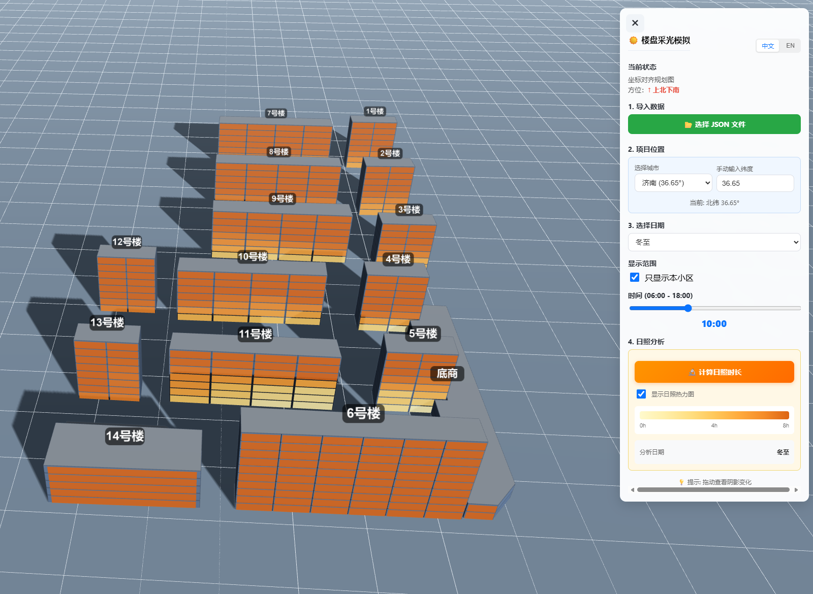
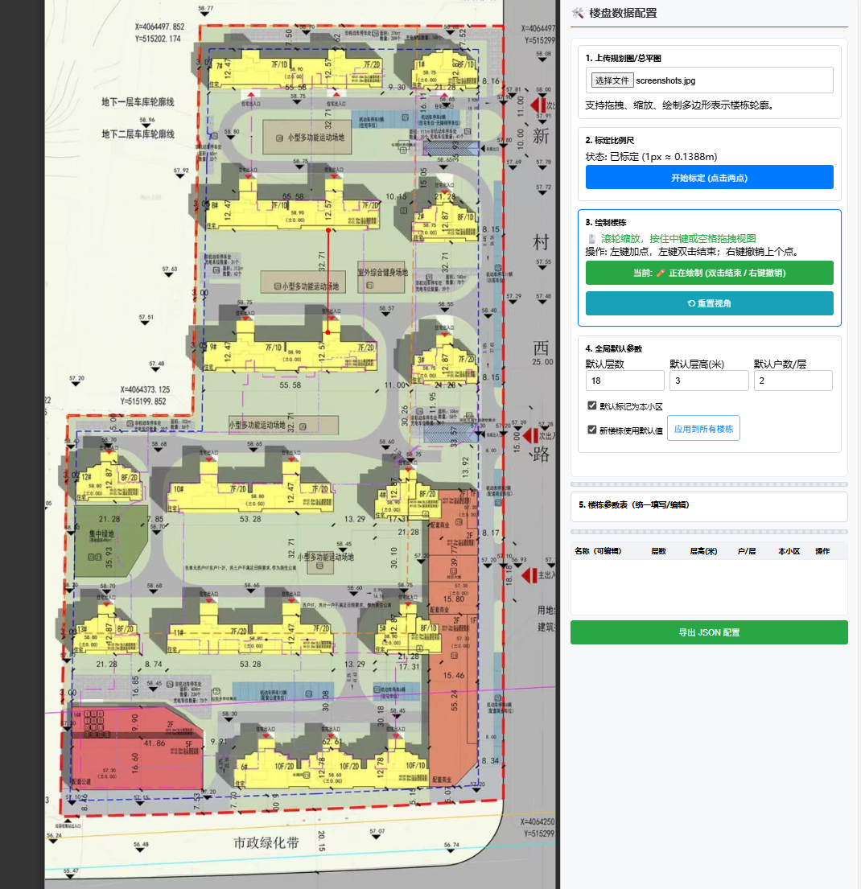

<p align="center">
  <span>English</span> | <a href="./README.md">简体中文</a>
</p>

<div align="center">

# 🏢 Building Sunlight Simulator

**Lightweight 3D Sunlight Analysis Tool for Building Planning**

<p>
    <a href="https://github.com/ruanyf/weekly/blob/master/docs/issue-382.md">
        
    </a>
  <a href="https://opensource.org/licenses/MIT">
    
  </a>
  <a href="https://threejs.org/">
    
  </a>
  <a href="https://github.com/seanwong17/building-sunlight-simulator/pulls">
    
  </a>
</p>

<h3>
  👉 <a href="https://seanwong17.github.io/building-sunlight-simulator/">Click for Live Demo</a> 👈
</h3>

<p style="font-size: 13px; color: #666;">
  Note: The live demo shows default sample data. To use your own floor plans, please refer to the "Local Usage" section below.
</p>



</div>

---

## 📋 Introduction

**Building Sunlight Simulator** is a web-based tool for architectural planning and sunlight simulation.

It lets users draw building outlines over a JPG/PNG plan, generate a 3D scene, and estimate sunlight occlusion using the project location and solar trajectory. The project is entirely frontend-based; all runtime dependencies ship in the repository, so it needs neither a backend nor a network connection.

---

## ✨ Core Features

| Module | Description |
|--------|-------------|
| **Deployment** | Pure static HTML/CSS/JS. Download and run, no environment installation required. |
| **Editor** | Converts 2D plans to 3D models with JSON/image drag-and-drop, building selection and movement, edit undo, and visual apartment splits. |
| **Calculation** | Uses spherical trigonometry for solar paths. Built-in coordinates and IANA time zones for 50+ major cities. |
| **Visuals** | High-precision 4096px shadow maps. Hemisphere-aware solstice/equinox labels and custom dates with local-civil-time adjustment (06:00-18:00). Professional compass for orientation. |
| **Quantification** | Estimates cumulative sunlight per apartment with a heatmap, apartment details, configurable reference duration, and reusable analysis results. |
| **Interaction** | Supports desktop and mobile controls plus file drag-and-drop. Filtering non-target buildings preserves the current camera view. |
| **Multi-language** | Supports Chinese/English switching. Language toggle available in the top-right corner. |

### 📊 Quantified Sunlight Analysis
* **Detection Point Generation**: For target buildings (`isThisCommunity: true`), every exterior-wall segment is mapped to an apartment along the configured split axis, with a detection point placed at window height on each floor. An apartment may span several facade segments; its reported duration is the maximum among those segments.
* **Duration Calculation**: Performs midpoint raycasting over 6-minute intervals from 06:00 to 18:00 local civil time. Longitude, IANA time zone, and the equation of time convert civil time to apparent solar time before each direction is calculated.
* **Heatmap Visualization**: Displays color-coded tiles on the sampled exterior-wall segments. It uses a warm color scheme from light yellow (0h) to deep orange (8h+).
* **Interaction**: Click a heatmap tile to inspect its floor, unit number, cumulative sunlight, and reference status. The reference duration is configurable and defaults to 2 hours.

> **Scope**: This is a planning visualization estimate based on cumulative 6-minute intervals and the maximum among an apartment's exterior-facade samples. It is not a universal regulatory compliance result. Formal assessment must apply local rules for dates, test points, and continuous-duration requirements.

### 🧭 Professional Compass
* Professional 3D compass on the ground clearly marks cardinal directions (N/S/E/W), with north highlighted in red, replacing traditional simple arrows for better orientation guidance.

---

## 🚀 Quick Start

The project consists of two core files: `editor.html` (Data Producer) and `index.html` (Data Consumer/Viewer).

### 1. Get the Project
```bash
git clone [https://github.com/seanwong17/building-sunlight-simulator.git](https://github.com/seanwong17/building-sunlight-simulator.git)
# Or download the ZIP directly
```

### 2. How to Run
No build tools are required. Choose one of the following methods:

* **Direct Open**: Double-click `editor.html` or `index.html` in your file explorer to run in the browser.
* **Local Server (Recommended)**: For hot-reloading or to avoid local file CORS restrictions, use `live-server` or `python -m http.server`.

---

## 📖 Usage Workflow

Flow: **Plan Configuration (Editor)** ➜ **Export JSON** ➜ **Sunlight Analysis (Viewer)**

### Step 1: Create Data (editor.html)
Open `editor.html` to convert your 2D floor plan into the JSON data required for 3D simulation.

1.  **Import a Project**: Click or drop a JPG/PNG plan to start a project, or import a previously exported JSON file to continue editing.
2.  **Calibrate Scale**: Pick two points on the map with a known distance (e.g., a scale bar) and input the actual distance in meters.
3.  **Draw and Adjust Buildings**: Left-click to plot points, then use Finish Outline or double-click to close the shape. Outside drawing mode, select and drag buildings; Undo Edit restores create, move, delete, and property changes.
4.  **Set Properties**: Configure floors, floor height, units per floor, and location. Use Visual Editor to adjust the split axis and apartment width ratios per floor or across all floors. Imported floor-specific unit counts are preserved; adding or removing floors extends ratios from the last floor or trims extra rows. Visual editing keeps every unit at 1% or more and dynamically caps the maximum ratio.
5.  **Export Config**: Click save to generate the configuration file (defaults to `data.json`).

<details>
<summary>📌 Editor Shortcuts</summary>

| Action | Shortcut |
|--------|----------|
| Zoom View | Mouse Wheel |
| Pan Canvas | Middle Mouse Button / Space + Left Click |
| Undo Point | Right Click |
| Complete Shape | Double Left Click |

</details>



### Step 2: Simulate (index.html)
Open `index.html` for 3D visualization and analysis.

1.  **Import Data**: Click the button or drop a JSON file onto the page to load an exported project (or use `examples/sample.json` for testing).
2.  **Adjust Environment**: Select a preset city or manually enter latitude, longitude, and an IANA time zone; switch dates (Winter/Summer Solstice/Spring Equinox/Autumn Equinox/Custom Date).
3.  **Observe Shadows**: Drag the time slider to observe sunlight occlusion on the target floors throughout the day. Ground compass indicates orientation.
4.  **Quantified Analysis**: Set a reference duration, then click "Calculate Sunlight Duration" to view the heatmap and apartment data. Click heatmap tiles to inspect individual units.
5.  **Reuse Results**: After calculation, export Project and Results. On re-import, the Viewer restores the saved season preset or exact custom date and loads the result when geometry, location, north angle, and sampling parameters still match. Changing only the reference duration reuses the computed hours and rebuilds the statistics.

---

## 📐 Data Protocol

The project uses JSON to transfer building data. `examples/sample.json` provides a complete example.

<details>
<summary>Click to view JSON Structure</summary>

```jsonc
{
  "version": 1.7,                  // Data version
  "latitude": 36.65,               // Latitude (Effects solar elevation)
  "longitude": 117.12,             // Longitude, east is positive
  "timeZone": "Asia/Shanghai",   // IANA time zone for civil-time conversion
  "scaleRatio": 0.483,             // Scale: 1 pixel = N meters
  "origin": { "x": 306, "y": 336 },// Coordinate system origin (pixels)
  "buildings": [
    {
      "name": "Building 1",
      "floors": 18,                // Number of floors
      "floorHeight": 3,            // Height per floor (meters)
      "totalHeight": 54,           // Optional; if supplied, must equal floors * floorHeight
      "isThisCommunity": true,     // Is target community (For highlighting/filtering)
      "shape": [                   // Vertex coordinates (Meters relative to origin)
        { "x": -19.18, "y": -107.28 },
        { "x": -19.18, "y": -115.55 },
        { "x": 2.51, "y": -115.31 }
      ],
      "center": { "x": -8.36, "y": -111.45 }
    }
  ]
}
```

</details>

Viewer exports may include a `precomputedSunlight` cache and its active analysis date. The application owns this field and validates the project fingerprint, sampling-point fingerprint, algorithm version, analysis parameters, and size limits. Stale or invalid entries are ignored and require recalculation.

---

## 🛠️ Tech Implementation

* **Engine**: Three.js (WebGL)
* **Shadows**: PCFSoftShadowMap
* **Offline Analysis**: Self-contained Web Worker with a triangle BVH; pinned Three.js r128 and OrbitControls assets live in `vendor/three-r128/`
* **Solar Algorithm**:
    * Solar Elevation: $\sin(h) = \sin(\phi)\sin(\delta) + \cos(\phi)\cos(\delta)\cos(\omega)$
    * Solar Azimuth: $\cos(A) = (\sin(h)\sin(\phi) - \sin(\delta)) / (\cos(h)\cos(\phi))$

### Project Structure

```
building-sunlight-simulator/
├── css/                    # Stylesheets
├── js/
│   ├── config.js          # Global configuration
│   ├── utils.js           # Utility functions
│   ├── i18n.js            # Internationalization
│   ├── cities.js          # City data
│   ├── editor.js          # Editor logic
│   ├── sunlight-worker.js # Offline ray-analysis Worker
│   └── viewer.js          # Viewer logic
├── examples/              # Sample data
├── tests/                 # Unit and browser regression tests
├── vendor/three-r128/     # Three.js, OrbitControls, and third-party license
├── editor.html            # Editor page
└── index.html             # Viewer page
```

---

## 🤝 Contribution

Issues and Pull Requests are welcome!

* **Issues**: [Bug reports & Feature requests](https://github.com/seanwong17/building-sunlight-simulator/issues)

---

## 🙏 Acknowledgements

The evolution of multi-facade sampling, facade heatmaps, unit splitting, and apartment interaction was informed by [@wingkinl](https://github.com/wingkinl)'s MIT-licensed fork of [building-sunlight-simulator](https://github.com/wingkinl/building-sunlight-simulator).

---

## 📄 License

[MIT License](LICENSE) © 2026 SeanWong17

The vendored Three.js and OrbitControls files are distributed under their MIT License; see [`vendor/three-r128/LICENSE`](vendor/three-r128/LICENSE).

---

## 📈 Star History

<picture>
  <source media="(prefers-color-scheme: dark)" srcset="https://raw.githubusercontent.com/SeanWong17/building-sunlight-simulator/star-history-assets/assets/star-history/star-history-dark.svg">
  
</picture>

---

<div align="center">
  <br>
  Made with ❤️ by <a href="https://github.com/seanwong17">seanwong17</a>
</div>
